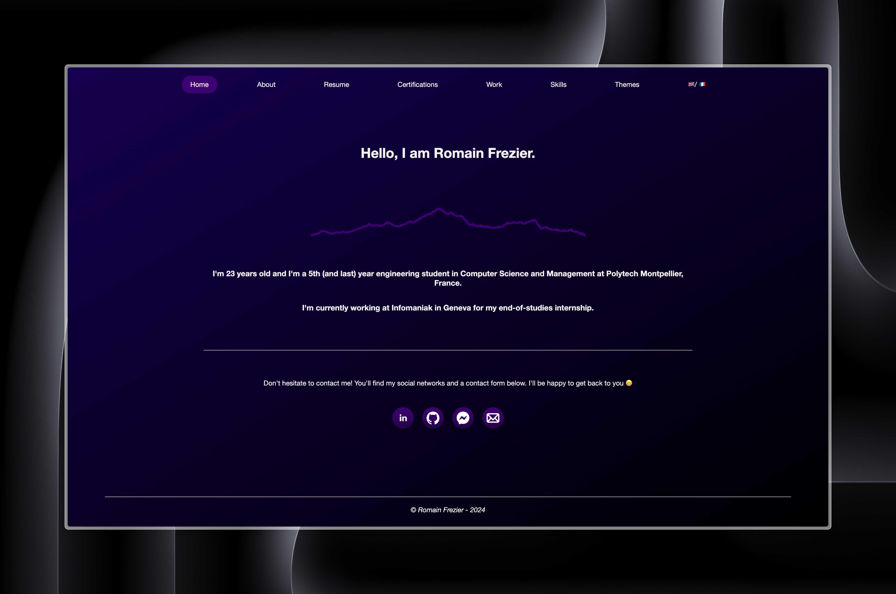

<h1 align="center" style="text-align: center;">Portfolio</h1>
<div align="center" style="text-align: center;">
  
  
  
</div>
<h3 align="center" style="text-align: center;">Technologies</h3>
<div align="center" style="text-align: center;">
  
  
  
  
  
</div>

---

<div align="center" style="text-align: center;">
  <a href="https://romainfrezier.com/">Live demo</a> •
  <a href="#description">Description</a> •
  <a href="#installation">Installation</a> •
  <a href="#usage">Usage</a> •
  <a href="#license">License</a>
</div>

---
<div align="center" style="text-align: center">
  
</div>


## Table of Contents

<!-- TOC -->
  * [Table of Contents](#table-of-contents)
  * [Description](#description)
    * [Features](#features)
    * [How It Works](#how-it-works)
  * [Installation](#installation)
  * [Usage](#usage)
    * [Launch app](#launch-app)
    * [Testing](#testing)
    * [SonarQube](#sonarqube)
  * [License](#license)
<!-- TOC -->

## Description

This portfolio website showcases my work, skills, and projects, serving as a professional hub for potential employers, collaborators, and clients.

### Features

- **Project Gallery**: Displays selected projects with descriptions, technologies used, and links to demos and source code.
- **Contact Form**: Allows visitors to contact me directly.
- **Theming**: Offers four themes to enhance the visual appeal and user experience.
- **Internationalization**: Supports multiple languages (French and English) to reach a broader audience.

### How It Works

Built with modern web technologies for performance and maintainability:

- **Frontend**: Developed with Angular for a dynamic user interface.
- **Testing**: Uses Jest for reliable and high-quality code.
- **Code Quality**: SonarQube integration to maintain code standards.
- **Hosting**: Deployed on Firebase Hosting.
- **CI/CD**: Utilizes GitHub Actions for continuous integration and deployment.

## Installation

**Prerequisites**

- `nvm`
- `yarn`

First, use the correct version of node (version 22) :

```bash
nvm use
```

To install the necessary dependencies, run the following command:

```bash
yarn
```

## Usage

### Launch app

To run the application, use the following command:

```bash
yarn start
```

The application will be running on `http://localhost:4200`.

### Testing

To run tests, use the following command:

```bash
yarn run test
```

or to run tests with coverage, use the following command:

```bash
yarn run test:coverage
```

### SonarQube

**Prerequisites**

- `docker`
- `docker-compose`

To launch sonarqube, use the following command:

```bash
docker-compose -f docker-compose.sonar.yml up -d
```

The application will be running on `http://localhost:9000`.

Create a `.env` file with the same content as `.env.example` file and replace `your_token` with your sonarqube token created from the `Security` tab in the `User` settings

Then scan the project using the following command:

```bash
./sonar.sh
```

This will scan the project and update the quality gate badge.

## License

This project is licensed under the GNU General Public License v3.0 - see the [LICENSE](LICENSE) file for details.

---

© Romain Frezier - 2024
