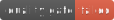

# Portfolio




## Technologies


## Table of Contents

<!-- TOC -->
* [Portfolio](#portfolio)
  * [Technologies](#technologies)
  * [Table of Contents](#table-of-contents)
  * [Description](#description)
  * [Installation](#installation)
  * [Usage](#usage)
    * [Launch app](#launch-app)
    * [Testing](#testing)
    * [SonarQube](#sonarqube)
  * [SonarQube in CI](#sonarqube-in-ci)
    * [Ngrok](#ngrok)
    * [GitHub Actions](#github-actions)
<!-- TOC -->

## Description

This is a portfolio website that showcases my work and provides a way to contact me.

## Installation

**Prerequisites**

- `nvm`

First, use the correct version of node (version 22) :

```bash
nvm use
```

To install the necessary dependencies, run the following command:

```bash
npm install
```

## Usage

### Launch app

To run the application, use the following command:

```bash
npm start
```

The application will be running on `http://localhost:4200`.

### Testing

To run tests, use the following command:

```bash
npm run test
```

or to run tests with coverage, use the following command:

```bash
npm run test:coverage
```

### SonarQube

**Prerequisites**

- `docker`
- `docker-compose`

To launch sonarqube, use the following command:

```bash
docker-compose -f docker-compose.sonar.yml up -d
```

The application will be running on `http://localhost:9000`.

Create a `.env` file with the following content:

```bash
SONAR_TOKEN=your_token
```

Replace `your_token` with your sonarqube token created from the `Security` tab in the `User` settings

Then scan the project using the following command:

```bash
./sonar.sh
```

## SonarQube in CI

**Prerequisites**

- `SonarQube` running on port `9000`
- `ngrok` account

### Ngrok

Install `ngrok`:

```bash
brew install ngrok/ngrok/ngrok
```

Log into `ngrok` dashboard, and get the token from the setup section:

```bash
ngrok config add-authtoken <token>
```

Start `ngrok` tunnel

```bash
ngrok http --domain=<static-free-domain> 9000
```

### GitHub Actions

Add the following GitHub secrets:
  1. `SONAR_TOKEN`: `<sonar token from .env>`
  2. `SONAR_HOST`: `<static-free-domain>`

---

© Romain Frezier - 2024
