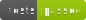

# Portfolio





## Technologies


## Table of Contents

<!-- TOC -->
* [Portfolio](#portfolio)
  * [Technologies](#technologies)
  * [Table of Contents](#table-of-contents)
  * [Description](#description)
  * [License](#license)
  * [Installation](#installation)
  * [Usage](#usage)
    * [Launch app](#launch-app)
    * [Testing](#testing)
    * [SonarQube](#sonarqube)
<!-- TOC -->

## Description

This is a portfolio website that showcases my work and provides a way to contact me.

## License

This project is licensed under the GNU General Public License v3.0 - see the [LICENSE](LICENSE) file for details.

## Installation

**Prerequisites**

- `nvm`

First, use the correct version of node (version 22) :

```bash
nvm use
```

To install the necessary dependencies, run the following command:

```bash
npm install
```

## Usage

### Launch app

To run the application, use the following command:

```bash
npm start
```

The application will be running on `http://localhost:4200`.

### Testing

To run tests, use the following command:

```bash
npm run test
```

or to run tests with coverage, use the following command:

```bash
npm run test:coverage
```

### SonarQube

**Prerequisites**

- `docker`
- `docker-compose`

To launch sonarqube, use the following command:

```bash
docker-compose -f docker-compose.sonar.yml up -d
```

The application will be running on `http://localhost:9000`.

Create a `.env` file with the same content as `.env.example` file and replace `your_token` with your sonarqube token created from the `Security` tab in the `User` settings

Then scan the project using the following command:

```bash
./sonar.sh
```

This will scan the project and update the quality gate badge.

---

© Romain Frezier - 2024
